Calling the Microsoft Graph with iOS
======================================
## Overview

The lab demonstrates how use an AzureAD account to authenticate and call the Microsoft Graph to access Calendar Events from an iOS app.

## Objectives

- Learn how to authenticate with Office 365
- Learn how to create an Microsoft Graph client to access calendar events
- Learn how to list calendar events

## Prerequisites

1. OSX 10.X environment
2. [XCode 9][xcode-9]
3. [Carthage dependency manager][cocoapods]
4. This lab requires you to use multiple starter files or an entire starter project from the GitHub location. You can either download the whole repo as a zip or clone the repo https://github.com/OfficeDev/TrainingContent.git for those familiar with git.

[xcode-9]: https://itunes.apple.com/nz/app/xcode/id497799835?mt=12
[carthage]: https://github.com/Carthage/Carthage

## Register your application with Office 365
1. Sign into the [https://apps.dev.microsoft.com//](https://apps.dev.microsoft.com/") using your Office 365 Developer Site credentials.
2. Click **Add an app** button at the topright of the page.
3. On the **Register your application** page, enter enter **IOSOffice365Calendar** for the application name. 
4. Click **Create** from the bottom of the page.
5. On the **IOSOffice365Calendar Registration** page, click **Add platform** under Platforms.
6. On the **Add Platform** dialog, select **Native Application** for the application.
    
7. Click the **arrow icon** on next to the Built-in redirect URIs, an it will expand the URIs used for redirect in the native application.
8. On the Native Application information section, make note of the Custome Redirect URIs, since you'll need this later when coding the IOSOffice365Calendar project.

9. Under th **Microsoft Graph Permissions**, add `Calendars.Read`, `User.Read` under **Delegated Permissions**. Under **Application Permissions**, add `User.Read.All (Admin Only)`.
    
10. Under **permissions to other applications**, click the **Delegated Permissions** column for **Microsoft Graph**
11. Select **Read User Calendars**.
12. Select **Sign in and read user profile**
13. Click **Save**
14. Copy the value specified for **Application ID**; you will need this later when coding the IOSOffice365Calendar project.


## Exercise 1: Add Microsoft Authentication Library for iOS, Rest Client for iOS libraries to a project
In this exercise you will use an existing application with the AzureAD
authentication included, to add Microsoft Authentication Library for iOS libraries in the project.

01. Locate the [\\\O3651\O3651-6 Mobile\IOS\Lab Files](Lab Files) folder that contains a starter project.
02. If you do not have Carthage installed, go ahead and install Carthage on your Mac. If you have brew, you can install it with the following command.
```shell
brew install Carthage
```
03. Create a cartfile: Copy `echo "github \"AzureAD/microsoft-authentication-library-for-objc\" \"master\"" > Cartfile` into the terminal and run the command.
04. Build the MSAL library: Copy `carthage update` into the terminal and run the command.
05. Open Project -> General tab, and click and drag the `MSAL.framework` into the `Linked Frameworks and Libraries`.

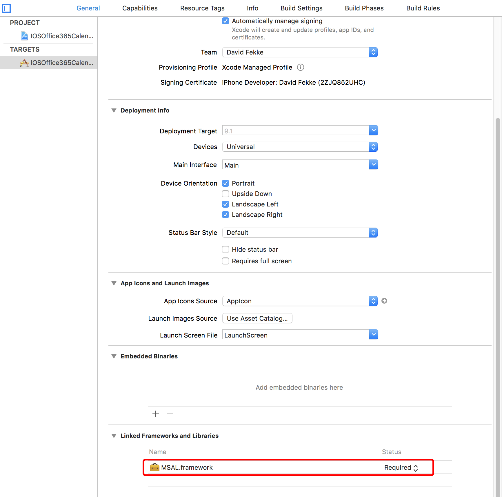

06. Click on the `Build Phases` tab and select the `IOSOffice365Calendar` under TARGETS. Click on the `+` symbol on the top left hand corner of the tab, and select `New Run Script Phase`.
07. Add the following command;
```
/usr/local/bin/carthage copy-frameworks
```
08. Click the + under Input Files and add an entry for each framework.
```
$(SRCROOT)/Carthage/Build/iOS/MSAL.framework
```
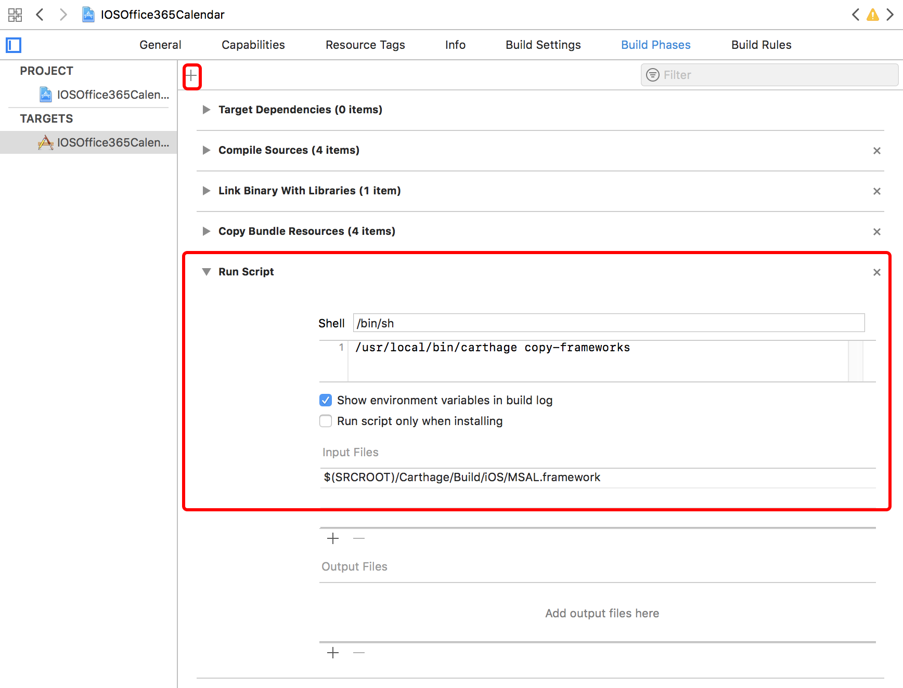

09. Edit the info.plist file and add the following xml to the end of the file.
```xml
<key>CFBundleURLTypes</key>
<array>
    <dict>
        <key>CFBundleTypeRole</key>
        <string>Editor</string>
        <key>CFBundleURLName</key>
        <string>$(PRODUCT_BUNDLE_IDENTIFIER)</string>
        <key>CFBundleURLSchemes</key>
        <array>
            <string>msalENTER_YOUR_CLIENT_ID</string>
            <string>auth</string>
        </array>
    </dict>
</array>
```
06. Replace the `ENTER_YOUR_CLIENT_ID` with the **Application Id** you received when registering the application.

07. Create a build in XCode by using the command key and B key keyboard combination: <kbd>command</kbd> + <kbd>B</kbd>.

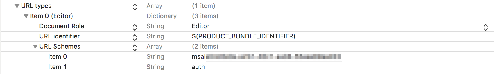

## Exercise 2: Authenticate with Azure AD and get the access token
An access token is required to access Microsoft Graph APIs so your application needs to implement the logic to retrieve and manage access tokens.

### To create the AuthenticationManager class
01. Right-click the IOSOffice365Calendar project folder, select **New File**, and in the **iOS** section, click **Cocoa Touch Class**, and then click **Next**.
02. Specify **AuthenticationManager** as the **Class**, **NSObject** for **Subclass of:**, **Objective-C** for **Language:**, and then click **Next**.
03. Click **Create** to create the class and header files.


### Make a change to the **AppDelegate.m** implementation file.

01. Add the following import statement to the **AppDelegate.m** file.
```objc
#import <MSAL/msal.h>
```

02. Add the `openURL` method to the implementation of your **AppDelegate.m** file.
```objc
- (BOOL)application:(UIApplication *)app openURL:(NSURL *)url options:(NSDictionary<NSString *,id> *)options
{
    
    [MSALPublicClientApplication handleMSALResponse:url];
    
    return YES;
}
```

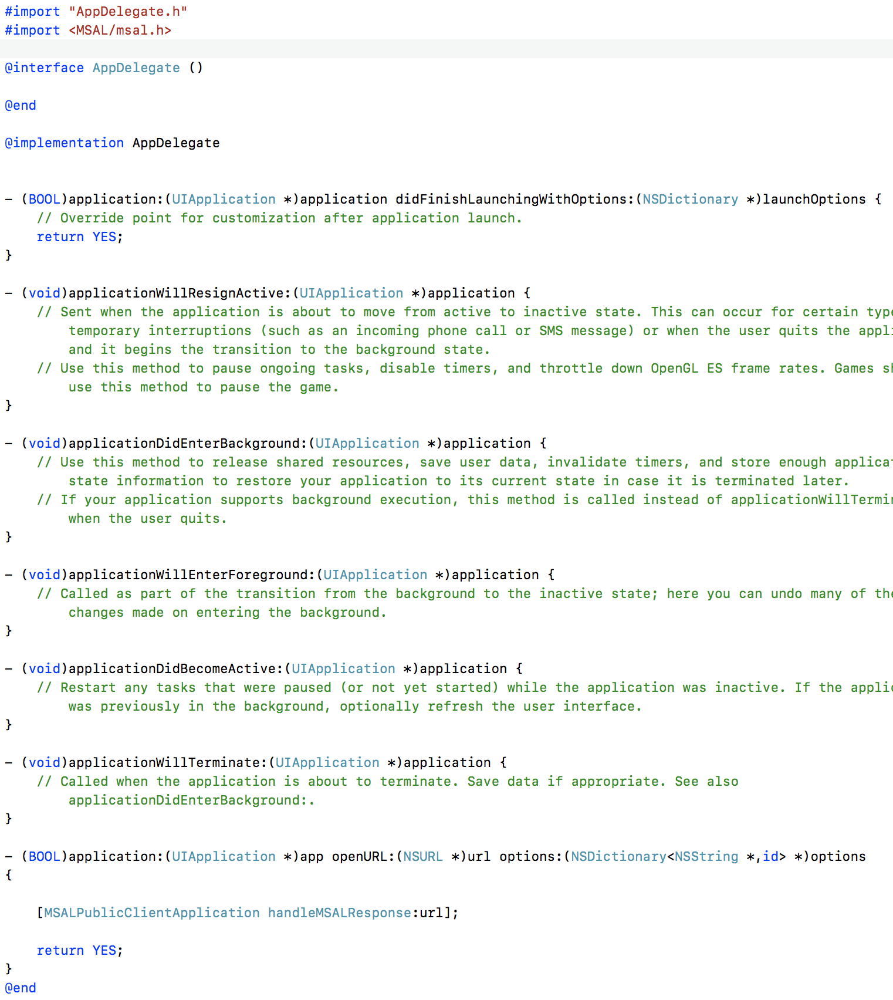

### To code the AuthenticationManager header file

01. Specify the **AuthenticationManager** class as a singleton in the to **AuthenticationManager.h**.

	```objc
	+(AuthenticationManager *)sharedInstance;
	```
02. Add the following properties in AuthenticationManager header file.
```objc
@property (nonatomic, strong) NSString *accessToken;
@property (nonatomic, strong) NSString *userID;
@property (nonatomic, strong) MSALPublicClientApplication *msalClient;
@property (nonatomic, weak) NSString *clientId;
@property (nonatomic, weak) NSString *authorty;
@property (nonatomic, strong) MSALUser *user;
```
03. Declare the methods for retrieving and clearing the access and refresh tokens.

    ```objc
	//retrieve token
    + (AuthenticationManager*)sharedInstance;

    - (void)initWithAuthority:(NSString*)authority
                   completion:(void (^)(NSError *error))completion;

    - (void)acquireAuthTokenWithScopes:(NSArray<NSString *> *)scopes
                            completion:(void(^)(MSALErrorCode error))completion;

    -(void) acquireAuthTokenCompletion:(void (^)(MSALErrorCode *error))completion;

    // Clears the ADAL token cache and the cookie cache.
    - (void) clearCredentials;

    - (NSString *) getRedirectUrlFromMSALArray:(NSArray *) array;
    ```

    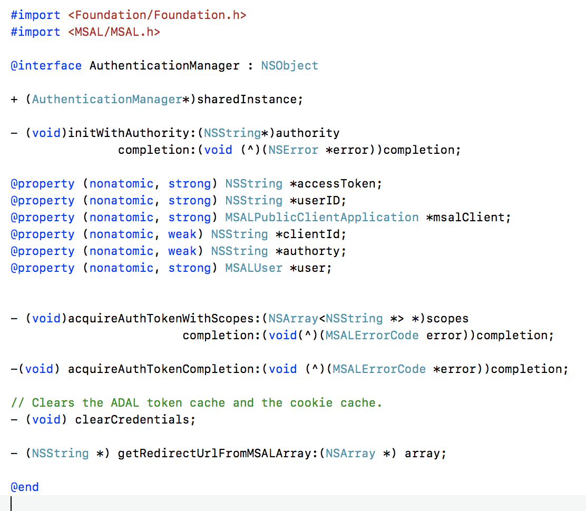

### To code the AuthenticationManager class

01. Add code for the constructor to the implementation in the **AuthenticationManager.m** file.

    ```objc
    #pragma mark - init
    - (void)initWithAuthority:(NSString*)authority_
                completion:(void (^)(NSError* error))completion
    {
        
        //Get the MSAL client Id for this Azure app registration. We store it in the main bundle
        NSDictionary *dictionary = [NSDictionary dictionaryWithContentsOfFile:[[NSBundle mainBundle] pathForResource:@"Info" ofType:@"plist"]];
        NSArray *array = [dictionary objectForKey:@"CFBundleURLTypes"];
        NSString *redirectUrl = [self getRedirectUrlFromMSALArray:(array)];
        
        NSRange range = [redirectUrl rangeOfString:@"msal"];
        NSString *kClientId = [[redirectUrl substringFromIndex:NSMaxRange(range)] stringByTrimmingCharactersInSet:[NSCharacterSet whitespaceCharacterSet]];
        NSLog(@"client id = %@", kClientId);
        
        self.clientId = kClientId;
        self.authorty = authority_;
        
        NSError *error_ = nil;
        @try {
            self.msalClient = [[MSALPublicClientApplication alloc] initWithClientId:kClientId error:&error_];
            if (error_) {
                completion(error_);
            } else {
                completion(nil);}
            
        }
        @catch(NSException *exception) {
            NSMutableDictionary * info = [NSMutableDictionary dictionary];
            [info setValue:exception.name forKey:@"ExceptionName"];
            [info setValue:exception.reason forKey:@"ExceptionReason"];
            [info setValue:exception.callStackReturnAddresses forKey:@"ExceptionCallStackReturnAddresses"];
            [info setValue:exception.callStackSymbols forKey:@"ExceptionCallStackSymbols"];
            [info setValue:exception.userInfo forKey:@"ExceptionUserInfo"];
            
            NSError *error = [[NSError alloc] initWithDomain:MSALErrorDomain code:MSALErrorInternal userInfo:info];
            //use error
            completion(error);
        }
        
    }
	```

3. Add the following code to use a single authentication manager for the application.

	```objc
	#pragma mark - singleton
    + (AuthenticationManager *)sharedInstance
    {
        static AuthenticationManager *sharedInstance;
        static dispatch_once_t onceToken;
        
        // Initialize the AuthenticationManager only once.
        dispatch_once(&onceToken, ^{
            sharedInstance = [[AuthenticationManager alloc] init];
        });
        
        return sharedInstance;
    }
	```

	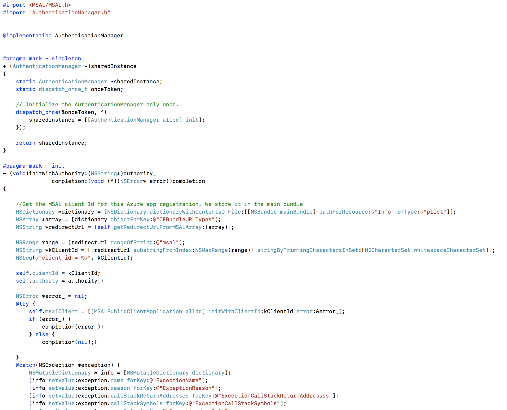

4. Acquire access and refresh tokens from Office 365 for the user.

```objc
    #pragma mark - acquire token

    - (void)acquireAuthTokenWithScopes:(NSArray<NSString *> *)scopes
                            completion:(void(^)(MSALErrorCode error))completion {
        
        NSError  __autoreleasing  *error_ = nil;
        
        NSArray<MSALUser *> *users = [self.msalClient users:(&error_)];
        
        // We check to see if we have a current logged in user. If we don't, then we need to sign someone in.
        // We throw an interactionRequired so that we trigger the interactive signin.
        
        if (self.msalClient == nil) {
            completion(MSALErrorInternal);
            
        }
        
        if (users == nil | [users count] == 0) {
            @try {
                [self.msalClient acquireTokenForScopes:scopes completionBlock:^(MSALResult *result, NSError *error) {
                    if (error) {
                        completion(error.code);
                    } else {
                        self.clientId = self.msalClient.clientId;
                        self.accessToken = result.accessToken;
                        
                        self.user = result.user;
                        self.userID = result.user.displayableId;
                        completion(0);
                        
                    }
                }];
            }
            @catch (NSException *exception) {
                completion(MSALErrorInternal);
            }
            
        } else {
            @try {
                self.user =  [users objectAtIndex:0];
                [self.msalClient acquireTokenSilentForScopes:scopes user:self.user completionBlock:^(MSALResult *result, NSError *error) {
                    if (error) {
                        completion(MSALErrorInteractionRequired);
                    } else {
                        self.clientId = self.msalClient.clientId;
                        self.accessToken = result.accessToken;
                        self.userID = result.user.displayableId;
                        
                        completion(0);
                        
                    }
                }];
            }
            @catch (NSException *exception) {
                completion(MSALErrorInternal);
            }
            
        }
        
    }
```
    >**Note:** The first time the application runs, a request is sent to the URL specified for the AUTHORITY const, which the redirects you to a login page where you can enter your credentials. If your login is successful, the response contains the access and refresh tokens. Subsequent times when the application runs, the authentication manager will use the access or refresh token for authenticating client requests, unless the token cache is cleared.

5. Finally, add code to log out the user by clearing the token cache and removing the application's cookies.

	```objc
	#pragma mark - clear credentials
    //Clears the ADAL token cache and the cookie cache.
    - (void)clearCredentials {
        
        NSError *error_ = nil;
        [self.msalClient removeUser:self.user error:&error_];
    }
	```

06. Add the following two methods to complete the **AuthenticationManager**.

```objc
-(void) acquireAuthTokenCompletion:(void (^)(MSALErrorCode *error))completion{
}

#pragma mark - Get client id from bundle

- (NSString *) getRedirectUrlFromMSALArray:(NSArray *) array {
    NSDictionary *arrayElement = [array objectAtIndex: 0];
    NSArray *redirectArray = [arrayElement valueForKeyPath:@"CFBundleURLSchemes"];
    NSString *substring = [redirectArray objectAtIndex:0];
    return substring;
}
```


### To code the Login Action
01. Open the LoginViewController.m file, and import the **AuthenticationManager.h**
   ```objc
   #import "AuthenticationManager.h"
   ```
02. Add the following code between the import statements and the `@implementation` statement.

```objc
NSString * const kAuthority   = @"https://login.microsoftonline.com/common/v2.0";

@interface LoginViewController()

@property (weak, nonatomic) NSArray *scopes;

@end
```

03. Add a `showLoadingUI` method to the implmentation.

```objc
- (void)showLoadingUI:(BOOL)loading {
    if(loading){
        [self.loginButton setTitle:@"Connecting..." forState:UIControlStateNormal];
        self.loginButton.enabled = NO;
    }
    else{
        [self.loginButton setTitle:@"Connect to Office 365" forState:UIControlStateNormal];
        self.loginButton.enabled = YES;
    }
}
```
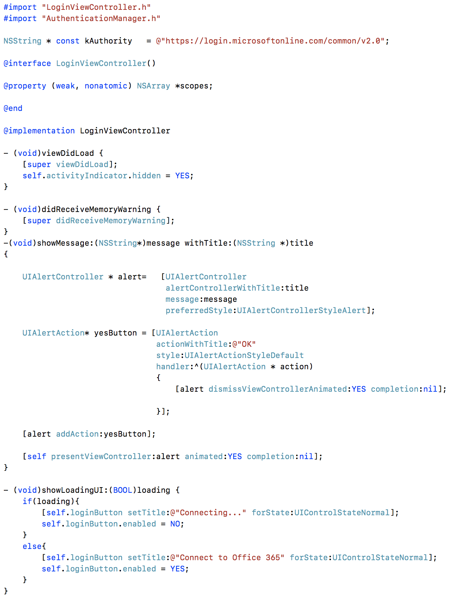

04. Open the LoginViewController.m file, add the following code to **loginAction**

   ```objc
   [self showLoadingUI:YES];
    
    self.scopes = [NSArray arrayWithObjects:@"https://graph.microsoft.com/Mail.ReadWrite",
                   @"https://graph.microsoft.com/Mail.Send",
                   @"https://graph.microsoft.com/Files.ReadWrite",
                   @"https://graph.microsoft.com/User.ReadBasic.All",
                   @"https://graph.microsoft.com/User.Read",
                   @"https://graph.microsoft.com/Calendars.Read", nil];

    AuthenticationManager *authenticationManager = [AuthenticationManager sharedInstance];
    [authenticationManager initWithAuthority:kAuthority completion:^(NSError *error) {
        if (error) {
            [self showLoadingUI:NO];
            [self showMessage:@"Please see the log for more details" withTitle:@"InitWithAuthority Error"];
        } else {
            [authenticationManager acquireAuthTokenWithScopes:self.scopes completion:^(MSALErrorCode error) {
                if(error){
                    [self showLoadingUI:NO];
                    [self showMessage:@"Please see the log for more details" withTitle:@"AcquireAuthToken Error"];
                } else {
                    dispatch_async(dispatch_get_main_queue(), ^{
                        [self showLoadingUI:NO];
                        [self showMessage:@"Authentication Succeeded." withTitle:@"Success"];
                        
                        NSLog(@"%@", [authenticationManager userID]);
                    });
                }
            }];
        }
    }];
   ```
   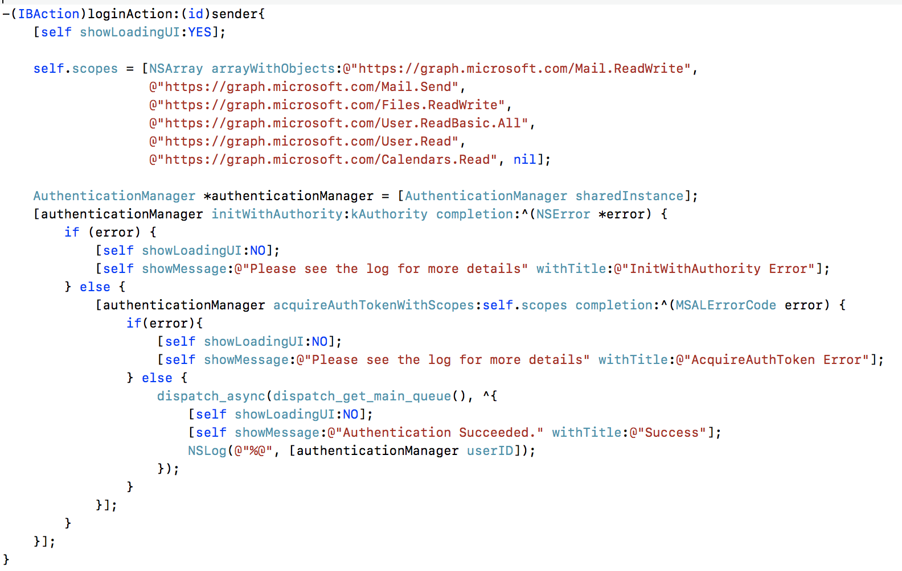

03. Open the LoginViewController.m file, add the following code to **clearAction**

```objc
    AuthenticationManager *authenticationManager = [AuthenticationManager sharedInstance];
    [authenticationManager clearCredentials];
    [self showMessage:@"Cookies Cleared" withTitle:@"Success"];
```


04. Build and run, now you can click **Login** to Authenticate with Office 365

   

5. Login Successfully.

   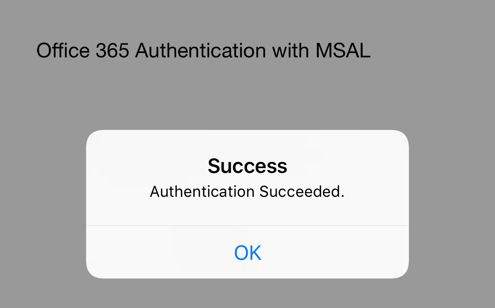

6. You can click **Clear** to sign out.

   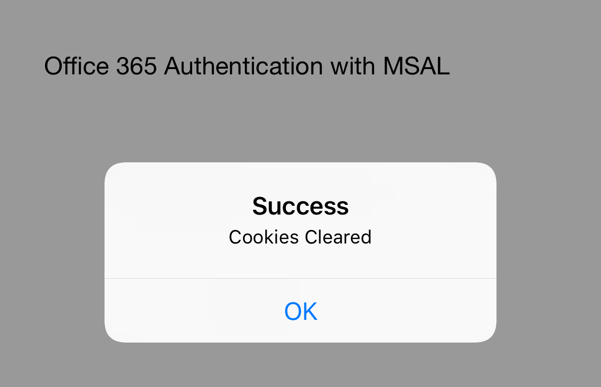


## Exercise 3: Connect to the Microsoft Graph to get Calendar events

In this exercise you will connect your application to get a **MSGraph** with a REST API call. We can get the calendar events form this client.

01. Alter the **LoginViewController.m** file, and add a transition to the CalendarTableViewController in the `-(IBAction)loginAction:(id)sender` method.

```objc
[authenticationManager acquireAuthTokenWithScopes:self.scopes completion:^(MSALErrorCode error) {
                if(error){
                    [self showLoadingUI:NO];
                    [self showMessage:@"Please see the log for more details" withTitle:@"AcquireAuthToken Error"];
                } else {
                    dispatch_async(dispatch_get_main_queue(), ^{
                        [self showLoadingUI:NO];
                        //[self showMessage:@"Authentication Succeeded." withTitle:@"Success"];
                        
                        UIStoryboard *board = [UIStoryboard storyboardWithName:@"Main" bundle:NSBundle.mainBundle];
                        UIViewController *calVC = [board instantiateViewControllerWithIdentifier:@"calendarList"];
                        
                        [self.navigationController pushViewController:calVC animated:YES];
                        NSLog(@"%@", [authenticationManager userID]);
                    });
                }
            }];
``` 
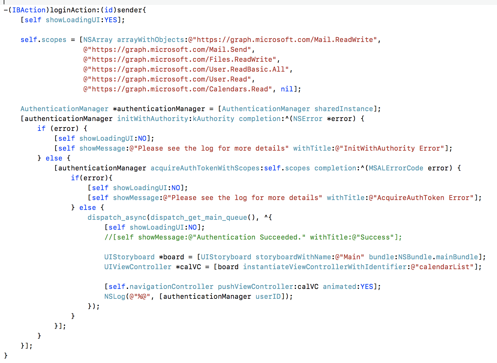

01. Go to **CalendarTableViewController.m**, and import the following header file
```objc
    #import <MSAL/msal.h>
```

	
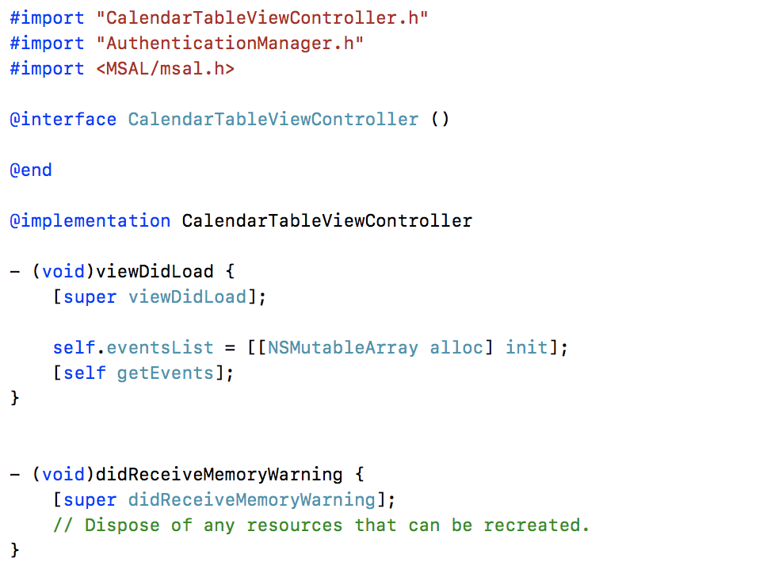


02. Add the following code into the bottom of the function **getEvents** to get the Login user's calendar events via the NSURLSession
```objc
    AuthenticationManager *authManager = [AuthenticationManager sharedInstance];
    
    UIActivityIndicatorView* spinner = [[UIActivityIndicatorView alloc]initWithFrame:CGRectMake(100,100,50,50)];
    spinner.activityIndicatorViewStyle = UIActivityIndicatorViewStyleWhiteLarge;
    [spinner setColor:[UIColor blackColor]];
    [self.view addSubview:spinner];
    spinner.hidesWhenStopped = YES;
    [spinner startAnimating];
    
    NSString *dataUrl = @"https://graph.microsoft.com/v1.0/me/events?$select=subject,body,bodyPreview,organizer,attendees,start,end,location";
    NSURL *url = [NSURL URLWithString:dataUrl];
    NSURLSessionConfiguration *config = [NSURLSessionConfiguration defaultSessionConfiguration];
    NSURLSession *session = [NSURLSession sessionWithConfiguration:config];
    
    // 2
    NSMutableURLRequest *request = [[NSMutableURLRequest alloc] initWithURL:url];
    request.HTTPMethod = @"GET";
    
    [request setValue:@"application/json" forHTTPHeaderField:@"Content-Type"];
    [request setValue:@"application/json, text/plain, */*" forHTTPHeaderField:@"Accept"];
    
    NSString *authorization = [NSString stringWithFormat:@"Bearer %@", authManager.accessToken];
    [request setValue:authorization forHTTPHeaderField:@"Authorization"];
    
    __weak CalendarTableViewController *weakSelf = self;
    NSURLSessionDataTask *task = [session dataTaskWithRequest:request
                                            completionHandler:^(NSData *data, NSURLResponse *response, NSError *error) {
                                                // ...
                                                CalendarTableViewController *strongSelf = weakSelf;
                                                NSError *jsonError = nil;

                                                NSDictionary *jsonFinal = [NSJSONSerialization JSONObjectWithData:data options:0 error:&jsonError];
                                                if (jsonError)
                                                {
                                                    NSLog(@"Error: %@", jsonError);
                                                }
                                                self.eventsList = [jsonFinal valueForKey:@"value"];
                                                dispatch_async(dispatch_get_main_queue(), ^{
                                                    [spinner stopAnimating];
                                                    [spinner removeFromSuperview];
                                                    [strongSelf.tableView reloadData];
                                                });
                                            }];
    
    [task resume];
```

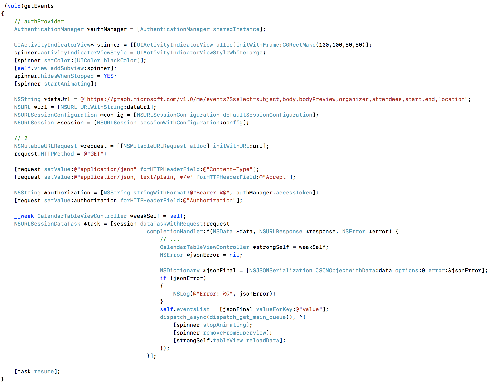

03. Go to the following function

```objc
	- (UITableViewCell *)tableView:(UITableView *)tableView cellForRowAtIndexPath:(NSIndexPath *)indexPath
```

04. Add the following code into the bottom of the function **cellForRowAtIndexPath**

```objc
    UILabel *subjectLabel = (UILabel *)[cell viewWithTag:100];
    NSDictionary *calendarItem = [self.eventsList objectAtIndex:indexPath.row];
    subjectLabel.text = [calendarItem valueForKey:@"subject"]; // ((MSGraphEvent *)[self.eventsList objectAtIndex:indexPath.row]).subject;;
    UILabel *startLabel = (UILabel *)[cell viewWithTag:200];
    NSString *startTime = (NSString *)[[calendarItem valueForKey:@"start"] valueForKey:@"dateTime"];
    NSString *endTime = (NSString *)[[calendarItem valueForKey:@"end"] valueForKey:@"dateTime"];
    startLabel.text = [NSString stringWithFormat:@"Start: %@",[self converStringToDateString:startTime]];
    UILabel *endLabel = (UILabel *)[cell viewWithTag:300];
    endLabel.text = [NSString stringWithFormat:@"End: %@",[self converStringToDateString:endTime]];
```

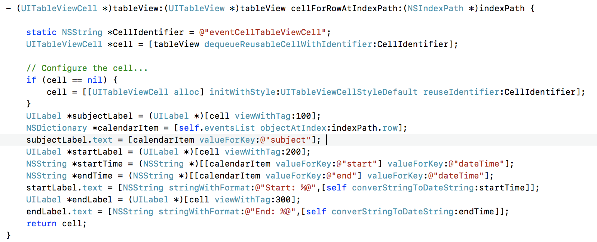

05. Build and Run the application. Click the Login button. Now you can see the  events list after you login successfully.

    

## Summary

In this exercise, you used the Microsoft Graph within an iOS application to read calendar events.
